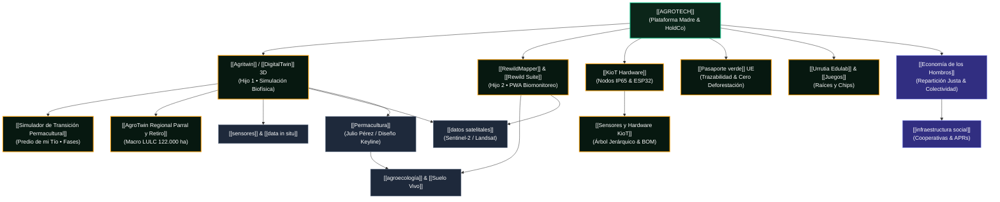
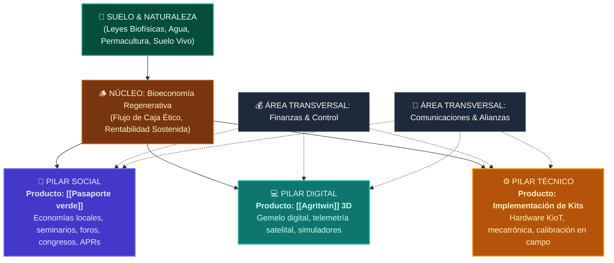

# 🌿 [[AGROTECH]] • Ecosistema Tecnológico & Regenerativo Integral

> **Tesis Central**: [[AGROTECH]] es una #Startup de base tecnológica y ecológica nacida en el Valle del Maule (Chile 🇨🇱) con proyección europea (España, Alemania 🇩🇪). Se dedica a la [[integración de sistemas]] agrícolas, la [[optimización de procesos]] biológicos y la resiliencia climática mediante el cruce de **datos satelitales**, **telemetría microclimática in situ** y un análisis de [[ingeniería]] sistémica fundado en los principios de la [[Permacultura]] y la [[agroecología]].

Opera no como un software extractivo tradicional, sino como una **herramienta de trabajo colectivo** con capacidades de [[ordenamiento territorial]], [[consultoría]] agronómica, modelación biofísica en 3D, e implementación de tecnologías basadas en el [[IoE]] (*Internet of Everything*), acompañadas de la fabricación local de hardware mecatrónico robusto.

---

## 🗺️ Grafo de Interconexión del Ecosistema (Obsidian Graph)

---

## 🏛️ 1. Arquitectura Triádica de los Sistemas (Madre + 2 Hijos)

Para evitar la sobrecarga de navegadores en zonas rurales con conectividad intermitente, la plataforma opera bajo una **arquitectura desacoplada de alto rendimiento**:

| Nivel | Entidad | Puerto Local | Stack Tecnológico | Rol Primario |
| :--- | :--- | :--- | :--- | :--- |
| **La Madre** | [[Urrutia AgroTech Core]] | `:7771` | React 18, Vite, Tailwind, Node.js | Orquestador maestro, finanzas, gobernanza, ingesta satelital ESA y portal público. |
| **Hijo 1** | [[Agritwin]] (3D Engine) | `:7773` | Three.js, WebGL 2.0, WebSockets, Shaders PBR | Gemelo digital biofísico, visualización de cuarteles, topografía LIDAR y alerta de heladas brote a brote. |
| **Hijo 2** | [[Rewild Suite]] & [[RewildMapper]] | `:7772` | Python HTTP, PWA Offline, IndexedDB, Turf.js | Auditoría de bosque nativo esclerófilo, inventario florístico de quebradas y emisión de créditos ecológicos sin señal celular. |

---

## 📦 2. Matriz de Productos y Servicios

### 🌟 Producto Insigne: [[Agritwin]] / [[DigitalTwin]] Predial
El principal baluarte tecnológico de [[AGROTECH]]. Modela en tres dimensiones cualquier predio agrícola conectando tres capas simultáneas:
1. **Capa Satelital**: Pases cada 5 días de Sentinel-2 L2A para calcular vigor vegetal (`NDVI`), contenido hídrico (`NDWI`) y estrés hídrico (`CWSI`).
2. **Capa Físico-Climática**: Algoritmos de balance de agua en suelo basados en [[FAO-56 Penman-Monteith]] en 3 estratos (0-20cm, 20-60cm, 60-100cm) y modelado katabático de drenaje de aire frío para predicción de heladas de radiación con 72h de anticipación.
3. **Capa In Situ (IoT)**: Recepción de telemetría desde los nodos [[KioT Hardware]] mediante WebSockets (<50ms) y LoRaWAN.

#### 📊 Generación de Informes Oficiales & Mapas de Riesgo
* **Informes de Riesgo Agroclimático**:
  * *Mapa de Incendios Forestales (FWI)*: Estimación de carga de biomasa combustible seca en interfaz rural y trazabilidad de cortafuegos.
  * *Mapa de Inundaciones & Anegamiento*: Modelo digital de elevación hidrológica para detectar escorrentías críticas y sectores anegables por crecidas de los ríos Longaví y Perquilauquén.
* **Informes de Captura de Carbono**: Medición cruzada de $CO_2$ in situ con sensores NDIR bajo dosel de bosque nativo y retención de materia orgánica en suelo vivo (t$CO_2$e/ha/año).
* **Informes Ecológicos**: Índice de Integridad Ecosistémica (IEI), corredores biológicos y cumplimiento estricto de no-deforestación EUDR.

#### 🚜 Interfaz de [[Simulador de Transición Permacultural]] (Predio de mi Tío)
Herramienta dentro de AgriTwin que evalúa el predio actual y genera un plan de reordenamiento escalonado por fases sin agotar recursos:
* Reorientación de horarios de bombeo a tarifa valle nocturna (-35% de gasto eléctrico inmediato).
* Plantación de cortinas cortavientos de peumo y quillay en el límite sur para frenar heladas cordilleranas.
* Trazado de zanjas en contorno (swales Keyline) para infiltración pasiva por gravedad hacia tranques.
* Parque agrovoltaico bifacial orientado 15° Norte para abastecer la bomba solar y proteger pasturas (-66% de consumo neto de kWh).

#### 🗺️ Extensión a Escala Macro: [[AgroTwin Regional Parral y Retiro]]
Permite visualizar la cuenca completa de 122.000 ha a menor resolución (10-30m) con clasificación multiclase de uso de suelo (LULC): bosque nativo, monocultivo forestal de pino, arrozal agrícola, ríos/embalses, cordillera y poblados rurales, usando los predios locales con AgriTwin como **red centinela in situ (*Ground-Truth Mesh*)** para calibrar alertas comunales de incendios y desbordes.

### 🛡️ Producto Estratégico 1: [[Pasaporte verde]] de Exportación

### 🌳 Producto Estratégico 2: [[RewildMapper]] & [[BioToken Rewild]]
* **Objetivo**: Creación de un mercado auditable de conservación de biodiversidad nativa maulina (peumo, boldo, quillay, hualo).
* **Certificados PBC (*Plant Biodiversity Certificates*)**: Unidades de biodiversidad vegetal emitidas bajo protocolos IPCC Tier-2, verificables mediante auditorías de terreno offline con **GoWild Survey** e imágenes satelitales.
* **Financiamiento**: Conexión directa entre propietarios de bosque nativo y empresas con compromisos ESG en Chile y Europa.

### ⚡ Producto Hardware: Nodos [[KioT Hardware]] & Kits de Automatización
Hardware diseñado y ensamblado con prototipado local para resistir barro, polvo y amplitud térmica maulina (-5°C a +40°C):
* **Gabinete**: Estanco IP65 impreso en PETG técnico con protección UV.
* **Procesamiento**: Microcontrolador ESP32 dual core con antena externa LoRaWAN (915 MHz) y WiFi Mesh.
* **Sensórica**: Sondas de temperatura industrial DS18B20 (±0.5°C) a nivel de suelo y canopia, sensores capacitivos de humedad V1.2 anticorrosión, barómetros BMP280 y sensores de mojadura foliar para alerta de *Botrytis*.
* **Actuadores**: Control directo de electroválvulas de riego de 12V, motobombas y sirenas acústicas antiheladas de 110dB.
* **Kits Especializados**:
  * *Kit Base*: Cultivo Protegido & Riego Inteligente.
  * *Kit Crítico*: Alerta Temprana Anti-Heladas Frutícola.
  * *Kit Fungi*: Cultivo de Hongos y Micelio con control de humedad ultrasónica y CO2.
  * *Kit Bio-Visión*: Cámara ESP32-CAM + IA de diagnóstico foliar.
  * *Kit Bio-Ahuyentador*: Radar microondas y ultrasonido (20-65 kHz) para disuasión ecológica de fauna invasora.

### 🎲 División Lúdico-Educativa: [[Urrutia Edulab]] & [[juegos]]
* **Juego "Raíces y Chips"**: Juego de cartas estratégico infantil y familiar donde los jugadores combinan insectos benéficos, micorrizas, sensores mecatrónicos y cubiertas vegetales para proteger su huerto frente a sequías y heladas.
* **Seminarios "Manos en la Tierra"**: Talleres presenciales en el Maule y streaming internacional sobre bioinsumos, permacultura aplicada y Google Earth Engine para agricultores.

---

## 🧭 3. Fundamento Filosófico y Científico

### [[Permacultura]] & Asesoría de Julio Pérez
La ingeniería de software y hardware de [[AGROTECH]] no imita modelos industriales extractivos; refleja los 12 principios del diseño permacultural de Bill Mollison y David Holmgren:
1. **Observar e Interactuar**: Antes de colocar un sensor o regar, se comprende el flujo de energía solar y los vientos predominantes.
2. **Captar y Almacenar Energía**: Diseño de tranques en cota alta, zanjas de infiltración (*swales* en contorno) y energía solar fotovoltaica con parques agrovoltaicos bifaciales.
3. **Obtener un Rendimiento**: Cada hectárea debe generar soberanía alimentaria, rentabilidad económica y regeneración ecosistémica.
4. **Zonificación Energética (Zonas 0 a 5)**:
   * **Zona 0**: El hogar y la central de procesamiento.
   * **Zona 1**: Huerto biointensivo, compost y semilleros de alta frecuencia.
   * **Zona 2**: Frutales menores, aves y riego tecnificado.
   * **Zona 3**: Cereales extensivos y viñedos de secano en rulo.
   * **Zona 4**: Silvopastoreo y madera sustentable.
   * **Zona 5**: Reserva silvestre intocada (monitoreada con [[Rewild Suite]]).
* **Asesoría Técnica**: En la sección de Permacultura, **Julio Pérez** asesora el diseño integral de la Start Up para asegurar que la infraestructura digital respete los ciclos biogeoquímicos de la cuenca.

### [[agroecología]] & Regeneración de Suelos
* Sustitución de fertilizantes sintéticos por consorcios microbiológicos nativos (bocashi, caldos sulfocálcicos, té de compost y extractos de quillay).
* Fomento del microbioma del suelo medido a través de la relación carbono/nitrógeno y la cromatografía de suelos.

---

## 🤝 4. Gobernanza Dual (SpA + Cooperativa de Trabajo) & "Árbol Pirámide"

> *"El tiempo, la autoría intelectual y la energía invertida por cada socio y cooperado deben ser reconocidos formalmente como el patrimonio más valioso de la organización."*

[[AGROTECH]] opera bajo un estándar corporativo dual estructurado para proteger activos tecnológicos, atraer inversión y redistribuir valor real a los miembros de terreno:

### 🌲 Los 3 Pilares y las Áreas Transversales:
1. **🌿 Pilar Social (Liderado por Wladimir)**:
   * **Producto Insigne**: [[Pasaporte verde]].
   * **Objetivo**: Establecer economías locales y generar infraestructura comercial para la venta justa de cosechas campesinas.
   * **Conexión Social**: Articula a la empresa con la comunidad a través de cursos de capacitación, seminarios, actividades de terreno, foros, congresos y convenios con comités de Agua Potable Rural ([[APRs]]).
2. **💻 Pilar Digital (Liderado por Daniel con Pablo y Paulina)**:
   * **Producto Insigne**: [[Agritwin]] / [[DigitalTwin]] 3D.
   * **Objetivo**: Plataforma digital de simulación biofísica, telemetría satelital Sentinel-2, modelos de heladas katabáticas y gemelo digital WebGL.
3. **⚙️ Pilar Técnico (Liderado por Paulina con Pablo)**:
   * **Producto Insigne**: **Implementación de Kits de Cultivo y Ganado**.
   * **Objetivo**: Fabricación e instalación de hardware local ([[KioT Hardware]]), calibración de sondas FDR en campo y redes LoRaWAN.
4. **Áreas Transversales**:
   * **Finanzas**: Wladimir & Pablo (Estructuración de flujos, modelos de suscripción y control de costos).
   * **Comunicaciones**: Daniel & Wladimir (Difusión institucional, congresos y relación con compradores ESG europeos).

### 👥 Distribución de Socios en AgroTech SpA (Sistema Mixto Capital + Sweat Equity)
Al inicio no existen sueldos de mercado; los socios ingresan con un **sistema mixto de inversión**: porcentaje de aporte inicial de capital sumado al trabajo y tiempo invertido (*sweat equity*), formalizado primero mediante contrato verbal transicional y posteriormente por un **Pacto de Accionistas escrito con calendario de Vesting (24-36 meses con Cliff de 6 meses)** para ganar derechos plenos sobre las acciones y el usufructo de los productos.

| Socio SpA | Pilares de Dedicación | Modalidad | Responsabilidades Clave |
| :--- | :--- | :--- | :--- |
| **Daniel Santander** | Digital • Dirección General • Producto | Fundador • Inversión Mixta | Arquitectura conceptual de AgriTwin, autoría moral del código fuente, dirección científica y alianzas ESG. |
| **Paulina (Prima)** | Técnico • Digital | Mixto (*Sweat Equity* + Taller) | Dirección de ensamblaje en Talca, diseño de placas PCB en KiCad, fabricación de gabinetes IP65 y pruebas de campo. |
| **Wladimir** | Finanzas • Social | Mixto (*Sweat Equity* + Finanzas) | Estrategia financiera, expansión del Pasaporte Verde, convenios con APRs, organización de seminarios, foros y congresos. |
| **Pablo** | Finanzas • Técnico • Digital | Mixto (*Sweat Equity* + Software) | Modelación financiera y comercial, optimización de algoritmos de software y soporte en implementación mecatrónica de kits. |

### 📜 Propiedad Intelectual y Derechos de Autoría de [[Agritwin]]
* **Derechos Morales (Inalienables)**: La ley 17.336 reconoce a **Daniel Santander** como el autor e ideólogo original de AgriTwin.
* **Propiedad Patrimonial & Usufructo Compartido**: Daniel otorga a **AgroTech SpA** una **Licencia Exclusiva de Uso, Explotación y Usufructo Comercial**.
  * De esta forma, la propiedad económica de la explotación es compartida con los socios que participan de su planificación e implementación, permitiendo que la SpA comercialice suscripciones SaaS y reparta dividendos a todos los accionistas.
  * Se establece una **cláusula de reversión**: si la SpA se disuelve o se aparta de los fines agroecológicos, la titularidad vuelve íntegramente a Daniel.

### 🐝 La Cooperativa de Trabajo AgroTech: La Red de Asociados
La Cooperativa es el vehículo asociativo de trabajo donde participan todos quienes colaboran en faenas de terreno, beneficiándose individualmente de la infraestructura y accediendo a contratos que no obtendrían de manera aislada:
* **Luis González (Asociado Cooperativa)**: Titular de empresa especializada en servicios aéreos con drones, fotogrametría de alta resolución, sensores multiespectrales (NDVI/NDRE) y cámaras térmicas FLIR. Sus vuelos nutren de ortomosaicos a AgriTwin.
* **Dra. Camila Morales (Asociada Edafología)**: Ingeniera Agrónoma experta en microbiología de suelos y planes de regeneración permacultural.
* **Matías Riquelme (Asociado Jurídico)**: Abogado experto en economía social, derecho de aguas y gobernanza cooperativa.
* **Ignacia Valenzuela (Asociada Alianzas Campesinas)**: Gestora de ferias locales, vínculo con pequeños productores e INDAP.

> 📄 *Ver documentación detallada y cláusulas en [[Estructura Corporativa y Gobernanza SpA Cooperativa]]*.

---

## 🌾 5. Predios Piloto y Validación en Terreno (*Ground Truth*)

| Predio | Ubicación | Superficie | Enfoque Tecnológico Principal |
| :--- | :--- | :--- | :--- |
| **[[Predio Meniels]]** | Parral, Maule (36.14°S, 71.82°O) | 24.8 ha | Gemelo Digital 3D completo en [[Agritwin]], 8 cuarteles, agrovoltaica bifacial, tranque Keyline y viña patrimonial País. |
| **[[Fundo El Boldo]]** | Valle de Curicó (35.02°S, 71.24°O) | 18.5 ha | Frutales de exportación (Cerezas Lapins/Regina), red antiheladas crítica y certificación [[Pasaporte verde]]. |
| **[[Reserva Quebrada Los Boldos]]** | Constitución, Costa (35.33°S, 72.39°O) | 62.0 ha | Biomonitoreo de bosque esclerófilo maduro, regeneración activa y emisión de créditos [[BioToken Rewild]]. |

---

## 📈 6. Modelo de Negocio y Tracción Financiera

> 📄 *Para la estrategia comercial detallada, arquitectura de precios por tiers, embudo de ventas y proyecciones a 24 meses, consultar la nota canónica: [[Plan Comercial y Go-To-Market SpA]].*

1. **Venta Transaccional Inmediata (B2C/B2B)**: Informes de Riesgo Climático Predial pre-compra (€80 a €200 por informe).
2. **Venta de Hardware IoT**: Kits KioT ($180.000 a $320.000 CLP) con margen de hardware del 48-58%.
3. **Suscripción SaaS Recurrente (ARR)**:
   * *AgroTwin Básico*: $45.000 CLP/mes.
   * *AgroTwin Pro*: $85.000 CLP/mes.
   * *AgroTwin Enterprise*: $160.000 CLP/mes.
   * *RewildMapper Cloud GIS*: $65.000 CLP/mes para fundos de conservación.
4. **Certificaciones ESG de Exportación**: €650 a €1.800 por fundo exportador para emisión del Pasaporte Verde UE.
5. **Mercado de Unidades de Biodiversidad (PBC)**: Comisión del 12% sobre transacciones de tokens ecológicos entre conservacionistas y corporaciones.

---

## 🔗 Conceptos y Enlaces Clave para Navegar en Obsidian

* [[Plan Comercial y Go-To-Market SpA]]
* [[AGROTECH]]
* [[Agritwin]] / [[DigitalTwin]]
* [[Simulador de Transición Permacultural]] (Predio de mi Tío / Meniels)
* [[AgroTwin Regional Parral y Retiro]] (Macro-Escala LULC 122.000 ha)
* [[Sensores y Hardware KioT]] (Árbol Ramificado de Sensórica y BOM)
* [[KioT Hardware]]
* [[RewildMapper]] / [[Rewild Suite]]
* [[Pasaporte verde]]
* [[juegos]] & [[Lab Agroecológico]]
* [[Permacultura]] (Asesoría Julio Pérez & Keyline)
* [[agroecología]]
* [[Economía de los Hombros]]
* [[ordenamiento territorial]]
* [[integración de sistemas]]
* [[optimización de procesos]]
* [[datos satelitales]] (Sentinel-2 L2A & Landsat)
* [[datos climáticos]] & [[datos meteorológicos]]
* [[sensores]] & [[data in situ]]
* [[infraestructura social]] & [[ecológica]]
* [[desarrollo sostenido]]
* [[predios agrícolas]]
* [[Predio Meniels]] (Parral, Maule)
* [[Fundo El Boldo]] (Curicó, Maule)
* [[Reserva Quebrada Los Boldos]] (Constitución, Maule Costa)
