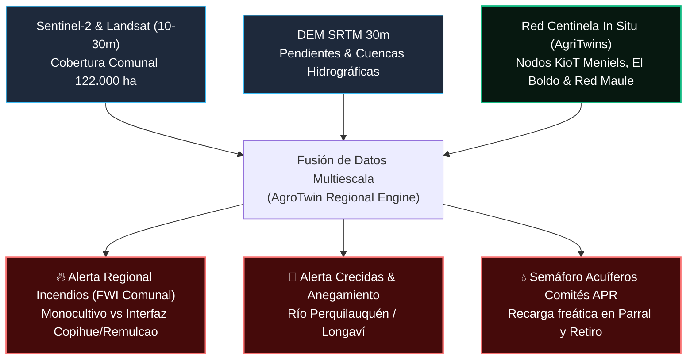
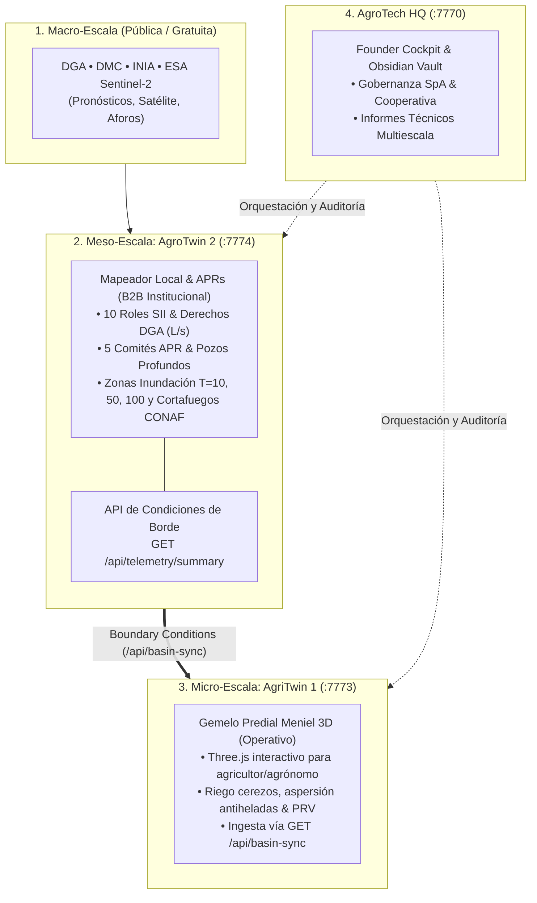

# 🗺️ [[AgroTwin Regional Parral y Retiro]] • Macro-Escala GIS & Red Centinela Comunal

> **Visión**: El **AgroTwin Regional** trasciende los límites de un único predio y modela la cuenca completa de las comunas de **Parral** y **Retiro** (122.000 hectáreas en el Maule Sur). Opera a menor resolución espacial (10m - 30m vía Sentinel-2, Landsat y SRTM DEM) pero se calibra continuamente con la **red de telemetría in situ (*Ground-Truth Mesh*)** aportada por los predios agrícolas que usan [[Agritwin]].

---

## 🛰️ 1. Clasificación Satelital de Cobertura y Uso de Suelo (LULC)

El modelo clasifica multiespectralmente las 122.000 ha de Parral y Retiro en 7 clases dinámicas:

| Clase LULC | Superficie (ha) | % Cuenca | Características & Riesgo Asociado |
| :--- | :--- | :--- | :--- |
| **🌲 Bosque Nativo Esclerófilo** | 18.400 ha | 15.1% | Precordillera (Bullileo, Digua) y parches costeros. Alta captura de carbono, amortiguador térmico. |
| **🌾 Agrícola Tradicional & Arroz** | 42.600 ha | 34.9% | Llano central Parral-Retiro. Principal polo arrocero de Chile. Vulnerable a sequía y heladas de primavera. |
| **💧 Cuerpos de Agua & Embalses** | 3.200 ha | 2.6% | Río Longaví, Río Perquilauquén, Embalse Digua y Tranque Bullileo. Monitoreo de cota y capacidad de regulación. |
| **🏔️ Cordillera & Montaña Andina** | 24.100 ha | 19.8% | Zonas de recarga nivopluvia y nacientes de cuenca. |
| **🌲 Monocultivo Forestal (Pino/Eucalipto)** | 31.800 ha | 26.1% | Plantaciones comerciales de alta densidad. **Vector crítico de propagación de incendios estivales**. |
| **🏙️ Urbano Central** | 1.450 ha | 1.2% | Ciudad de Parral y pueblo de Retiro. Alta densidad poblacional e infraestructura crítica. |
| **🏡 Villorrios & Poblados Rurales** | 820 ha | 0.7% | Copihue, Remulcao, San Manuel, Catillo, Talquita. Interfaz rural-forestal altamente expuesta. |

---

## 📡 2. La Red Centinela (*Ground-Truth Mesh*): De lo Local a lo Comunal

¿Cómo se alimenta este Gemelo Regional sin costos astronómicos?
1. **Predios Locales como Boyas Terrestres**:
   * Cada predio con [[Agritwin]] (como el [[Predio Meniels]]) cuenta con estaciones [[KioT Hardware]] midiendo humedad del suelo a 4 profundidades, temperatura de brote y viento cada 60 segundos.
2. **Calibración en Cascada de Satélites**:
   * La reflectancia espectral de Sentinel-2 se contrasta con las lecturas reales del suelo de los predios centinela. Si un píxel satelital muestra sequedad y el sensor in situ corrobora humedad de suelo crítica (&lt;15% VWC), el algoritmo eleva la alerta para todo el sector circundante de la comuna.
3. **Monitoreo de Fenómenos Regionales**:



---

## 🔥 3. Mitigación de Incendios Forestales en Interfaz
* **Detección del Viento Puelche**: Viento cálido y seco que desciende de la cordillera andina hacia el llano de Parral y Retiro, bajando la humedad ambiental a menos del 15% en cuestión de horas.
* **Índice FWI Comunal**: Permite al Municipio de Parral y a CONAF focalizar patrullajes y verificar el estado de los cortafuegos en la interfaz entre los monocultivos de pino y los villorrios de Copihue y Remulcao.

## 🌊 4. Alerta Temprana de Inundaciones
* Monitoreo de niveles del Río Perquilauquén y canales matrices de la Asociación de Canalistas de Parral.
* Simulación hidrológica que anticipa cortes de caminos vecinales y anegamiento de cuarteles arroceros en invierno.

---

## 🏛️ 6. Arquitectura del Embudo Táctico (Holding Multi-Puerto)

Para evitar la competencia inviable contra supercomputadores universitarios (CR2, CITRA U. de Talca) y responder a perfiles de cliente diferenciados, el sistema se desacopla en tres escalas articuladas:



### 6.1 Endpoints y Tuberías de Datos Activas

| Endpoint | Puerto | Tipo | Función |
| :--- | :--- | :--- | :--- |
| `GET /api/telemetry/summary` | `:7774` | JSON REST | Expone las 9 estaciones de la Red Centinela, índices FWI, caudal del Río Longaví y métricas APR. |
| `GET /api/basin-sync` | `:7773` | Bridge Proxy | Consume a `:7774` y combina las condiciones de cuenca con el estado del Fundo Meniel (tranque, VWC). |
| `GET /api/health` | `:7774` & `:7773` | Healthcheck | Monitoreo de liveness de los microservicios Node.js en macOS. |

### 6.2 Implementación del Puente en Node.js (`agritwin/server.cjs`)
```javascript
// Conexión viva de AgriTwin 1 (:7773) hacia AgroTwin 2 (:7774)
if (urlPath === '/api/basin-sync') {
  const regionalReq = http.get('http://127.0.0.1:7774/api/telemetry/summary', { timeout: 1200 }, (regRes) => {
    let data = '';
    regRes.on('data', chunk => data += chunk);
    regRes.on('end', () => {
      const regJson = JSON.parse(data);
      res.writeHead(200, { 'Content-Type': 'application/json' });
      res.end(JSON.stringify({
        source: 'regional-live-7774',
        fundoMeniel: { areaHa: 24.8, tranqueM3: 18500, tranqueFillPct: 92 },
        regionalCuenca: regJson
      }));
    });
  });
  regionalReq.on('error', () => serveFallbackTelemetry(res));
}
```

### 6.3 Scripts de Consulta Rápida (CLI & Python)
```bash
# Consultar telemetría regional en vivo
curl -s http://localhost:7774/api/telemetry/summary | jq .derived

# Verificar sincronización de cuenca en Fundo Meniel
curl -s http://localhost:7773/api/basin-sync | jq .regionalCuenca.hydrology
```

---
*Vínculos*: [[AGROTECH]] • [[Agritwin]] • [[Predio Meniels]] • [[Simulador de Transición Permacultural]] • [[KioT Hardware]] • [[RewildMapper]] • [[Economía de los Hombros]]
