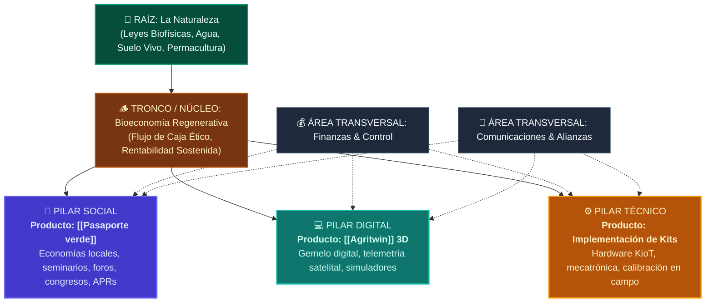
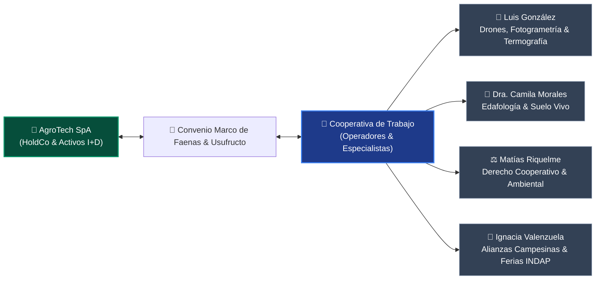

# 🏛️ Estructura Corporativa & Gobernanza Dual: SpA y Cooperativa de Trabajo

> **Marco de Alianza Estratégica**: [[AGROTECH]] opera bajo una **arquitectura institucional híbrida** diseñada para blindar los activos tecnológicos intangibles, atraer inversión y transferir valor directo a las comunidades agrícolas del Maule. Se compone de dos entidades sinérgicas:
> 1. **AgroTech SpA (Sociedad por Acciones)**: Vehículo mercantil para propiedad de activos, desarrollo de software, I+D y captación de capital.
> 2. **Cooperativa de Trabajo AgroTech**: Vehículo social de membresía abierta para contratistas, técnicos, operadores de drones y trabajadores rurales que ejecutan faenas y acceden a nuevas oportunidades económicas.

---

## 🌲 1. Modelo del "Árbol Pirámide" (Arquitectura de Producto y Áreas)

El modelo no sigue una jerarquía corporativa piramidal tradicional de mando y control, sino un **organismo vivo en forma de Árbol Pirámide**:

### Detalle de los Tres Pilares y sus Productos:

1. **🌿 Pilar Social (Líder: Wladimir)**:
   * **Producto Insigne**: [[Pasaporte verde]].
   * **Misión**: Establecer economías locales y crear infraestructura logística y de confianza para la venta justa de alimentos y uvas campesinas.
   * **Acciones**: Conecta a la empresa con la sociedad civil mediante congresos, foros, cursos de capacitación, seminarios presenciales y convenios con comités de Agua Potable Rural ([[APRs]]).

2. **💻 Pilar Digital (Líderes: Daniel con Pablo y Paulina)**:
   * **Producto Insigne**: [[Agritwin]] / [[DigitalTwin]] 3D.
   * **Misión**: Creación y mantenimiento del motor gráfico WebGL, shaders de suelo, algoritmos de evapotranspiración [[FAO-56 Penman-Monteith]], alertas tempranas de heladas e ingesta satelital Sentinel-2.

3. **⚙️ Pilar Técnico (Líderes: Paulina con Pablo)**:
   * **Producto Insigne**: **Implementación de Kits de Cultivo y Ganado**.
   * **Misión**: Fabricación de hardware local, ensamblado de gabinetes estancos IP65, diseño de placas PCB en KiCad, calibración de sensores de humedad de suelo por capacitancia e instalación de radioenlaces LoRaWAN (915 MHz).

4. **Transversales**:
   * **Finanzas**: Wladimir & Pablo (Estructuración de costos, flujos de caja, gestión de subvenciones CORFO/INDAP y precios de mercado).
   * **Comunicaciones**: Daniel & Wladimir (Difusión comunitaria, relaciones institucionales con universidades y compradores ESG europeos).

---

## 👥 2. Matriz de Roles y Asignación de Socios en la SpA

| Socio / Miembro | Entidad | Pilares Asignados | Modalidad de Ingreso | Responsabilidad Clave |
| :--- | :--- | :--- | :--- | :--- |
| **Daniel Santander** | AgroTech SpA | Digital • Dirección General • Producto | Fundador Original • Inversión Mixta | Arquitectura de AgriTwin, autoría moral de software, visión sistémica permacultural y alianzas internacionales. |
| **Paulina (Prima)** | AgroTech SpA | Técnico • Digital | Mixto (*Sweat Equity* + Capital inicial) | Ensamblaje de hardware en Talca, control de calidad mecatrónica, pruebas de campo y soporte técnico. |
| **Wladimir** | AgroTech SpA | Finanzas • Social | Mixto (*Sweat Equity* + Gestión) | Estructuración económica, pasaporte verde, vinculación comunitaria, foros, congresos y relaciones gremiales. |
| **Pablo** | AgroTech SpA | Finanzas • Técnico • Digital | Mixto (*Sweat Equity* + Desarrollo) | Modelos financieros de suscripción, optimización de algoritmos de software y soporte en despliegue de kits. |

---

## 🐝 3. La Cooperativa de Trabajo AgroTech (Ecosistema de Asociados)

La Cooperativa agrupa a todos quienes colaboran operativamente con AgroTech beneficiándose como miembros individuales de una red de servicios tecnológicos:

### Asociados Destacados de la Cooperativa:

1. **Luis González**:
   * **Perfil / Empresa**: Titular de empresa especializada en servicios aéreos de drones, fotogrametría de alta resolución, sensores multiespectrales (NDVI/NDRE) y cámaras térmicas FLIR.
   * **Rol en AgroTech**: Proveedor cooperado de ortomosaicos aéreos centimétricos para alimentar las texturas y curvas de nivel LIDAR en [[Agritwin]].
   * **Beneficio**: Acceso a cartera cautiva de clientes de AgroTech SpA, participación en excedentes cooperativos y uso de la infraestructura digital.

2. **Dra. Camila Morales (Perfil Asociado Edafología)**:
   * **Especialidad**: Microbiología de suelos, cromatografía de Pfeiffer y diseño permacultural regenerativo.
   * **Rol**: Formulación de planes de fertilidad para los predios suscritos al Pasaporte Verde.

3. **Matías Riquelme (Perfil Asociado Jurídico)**:
   * **Especialidad**: Abogado especialista en cooperativismo, derecho de aguas y gobernanza territorial.
   * **Rol**: Custodia de los convenios entre SpA y Cooperativa y cumplimiento de la Ley General de Cooperativas (DFL 5).

4. **Ignacia Valenzuela (Perfil Asociada Social & Mercados)**:
   * **Especialidad**: Ingeniera comercial rural y gestora de ferias campesinas.
   * **Rol**: Despliegue de los seminarios, foros ciudadanos y eventos comunitarios del Pilar Social.

---

## ⚖️ 4. Evaluación Estratégica y Recomendaciones Legales / Administrativas

### A. Sistema Mixto de Socios en la SpA (*Capital + Sweat Equity*)
* **Diagnóstico**: Al inicio no hay flujo de caja para sueldos de mercado; los socios aportan tiempo, experiencia y redes (*sweat equity*), complementado con pequeñas inyecciones de capital operativo.
* **Riesgo**: Los acuerdos verbales generan ambigüedad sobre qué significa "tiempo invertido" si un socio reduce su ritmo o se retira a los 6 meses exigiendo el 25% de la empresa.
* **Recomendaciones**:
  1. **Contrato de Vesting por Hitos y Tiempo (Pacto de Accionistas)**:
     * Establecer un periodo de consolidación de 24 a 36 meses con un *Cliff* de 6 meses.
     * Si un socio se retira antes del Cliff, devuelve sus acciones por el valor nominal.
  2. **Definición de Hitos Concretos por Pilar**:
     * *Paulina*: Entrega de 20 kits KioT ensamblados y testeados en campo.
     * *Pablo*: Cierre de módulo de facturación/suscripción y optimización del motor Three.js.
     * *Wladimir*: Modelo financiero de punto de equilibrio, 2 eventos/foros comunitarios y primeros 10 predios en Pasaporte Verde.
     * *Daniel*: Arquitectura general, integración de mapas y software AgriTwin funcional.

### B. Propiedad Intelectual (PI) y Derechos de Autor de AgriTwin
* **Situación**: Daniel es el autor e ideólogo original de AgriTwin. Los demás socios participan en su planificación, afinamiento técnico e implementación comercial.
* **Recomendación Jurídica**:
  1. **Derechos Morales (Inalienables)**: Quedan irrevocablemente a nombre de **Daniel Santander** como autor del software (conforme a la Ley 17.336 de Propiedad Intelectual en Chile).
  2. **Derechos Patrimoniales y Usufructo Compartido**:
     * Daniel otorga a **AgroTech SpA** una **Licencia Exclusiva de Uso, Explotación y Usufructo Comercial a Nivel Global**.
     * De esta forma, la SpA puede comercializar AgriTwin, vender licencias SaaS y cobrar suscripciones, distribuyendo los dividendos generados entre todos los socios accionistas (Paulina, Pablo, Wladimir, Daniel).
     * **Cláusula de Reversión**: Si la SpA quiebra, se disuelve o se desvía de los principios agroecológicos fundacionales, la licencia revierte a Daniel, protegiendo el activo intelectual de caer en manos de terceros especulativos.

### C. Vínculo entre la SpA y la Cooperativa de Trabajo
* **Estructura Recomendada**:
  * La **SpA** retiene la tecnología central, el software, las patentes y la marca.
  * La **Cooperativa** retiene la fuerza de trabajo territorial, las cuadrillas de instalación y la flota de drones de sus miembros (como Luis González).
  * La SpA subcontrata faenas a la Cooperativa con margen preferencial, asegurando que los cooperados cobren tarifas dignas y reciban retornos cooperativos a fin de ejercicio.
