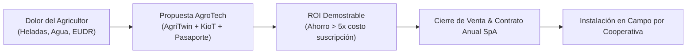
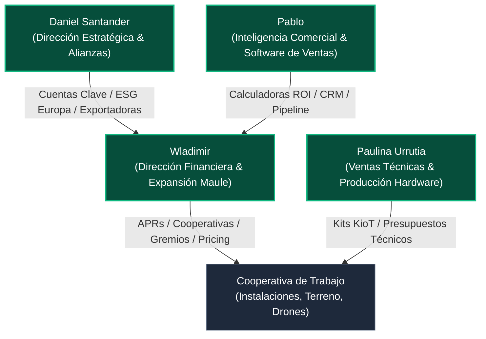

# 💼 [[Plan Comercial y Go-To-Market SpA]] • Ecosistema [[AGROTECH]]

> **Propósito del Documento**: Establecer la hoja de ruta comercial, la arquitectura de precios, el embudo de ventas en terreno y la proyección financiera de **AgroTech SpA** en articulación con la **Cooperativa de Trabajo**, para su presentación, validación y ejecución por parte del equipo fundador (**Daniel Santander**, **Paulina Urrutia**, **Wladimir** y **Pablo**).

---

## 🎯 1. Tesis Comercial: "De la Ciencia al Retorno Tangible"

El agricultor del Maule y la zona central no adquiere tecnología por novedad; compra **mitigación de riesgos catastróficos** y **reducción de costos operativos directos**:

1. **Protección ante Heladas Críticas**: En cerezos y arándanos, una sola helada primaveral de -2°C puede destruir entre **\$15.000.000 y \$35.000.000 CLP por hectárea**. El Kit KioT Anti-Heladas + AgriTwin alerta con **72 horas de anticipación** y activa defensas automáticas, amortizando el sistema en una sola noche.
2. **Ahorro Eléctrico en Bombeo de Riego**: La combinación de telemetría hídrica y algoritmos de optimización tarifaria permite desplazar el bombeo a horario valle nocturno, logrando una **reducción del 30% al 38% en la factura eléctrica mensual**.
3. **Pasaporte Verde EUDR para Exportación**: A partir de las regulaciones europeas de no-deforestación y huella ambiental, los exportadores sin trazabilidad satelital arriesgan el **rechazo total de cargamentos en puertos europeos**. AgroTech entrega la certificación auditada llave en mano.



---

## 📦 2. Catálogo de Soluciones y Arquitectura de Precios (*Pricing*)

AgroTech opera un modelo de ingresos diversificado que combina **ingresos recurrentes (SaaS)**, **venta de hardware de margen alto** y **servicios especializados de consultoría/certificación**.

### A. [[Agritwin]] • Plataforma SaaS de Gemelo Digital Predial

| Plan | Destinatario | Hectáreas | Funcionalidades Clave | Precio Mensual (CLP) | Precio Anual (Descuento 15%) |
| :--- | :--- | :--- | :--- | :--- | :--- |
| **Básico (Predio Familiar)** | Pequeño agricultor / Parcela | Hasta 10 ha | Índices Sentinel-2 (NDVI, NDWI), alerta heladas WhatsApp, 1 usuario | **\$45.000 CLP/mes** | \$459.000 CLP/año |
| **Pro (Frutícola / Viña)** | Fundo comercial mediano | Hasta 50 ha | Gemelo 3D WebGL, FAO-56 balance hídrico, predicción katabática 72h, multi-cuartel | **\$85.000 CLP/mes** | \$867.000 CLP/año |
| **Enterprise / Exportador** | Exportadoras / Múltiples predios | > 50 ha o varios fundos | Auditoría EUDR continua, API LoRaWAN ilimitada, vuelos multiespectrales trimestrales | **\$160.000 CLP/mes** | \$1.632.000 CLP/año |

* **Setup Fee Inicial**: \$120.000 a \$250.000 CLP (digitalización georreferenciada de cuarteles, calibración inicial satelital y configuración de alertas).

---

### B. [[KioT Hardware]] • Nodos IoT y Automatización

| Modalidad | Descripción | Costo BOM Interno | Precio Venta Cliente | Margen Bruto SpA | Instalación (Cooperativa) |
| :--- | :--- | :--- | :--- | :--- | :--- |
| **Venta Directa Kit Base (Riego)** | Nodo IP65 + Sonda Humedad Suelo + Relé electroválvula | \$38.500 CLP | **\$185.000 CLP** | 58% (\$107.500 CLP) | \$39.000 CLP (a cooperado) |
| **Venta Directa Kit Heladas** | Nodo IP65 + Sonda DS18B20 + Presión + Sirena 110dB | \$44.200 CLP | **\$220.000 CLP** | 59% (\$130.800 CLP) | \$45.000 CLP (a cooperado) |
| **Venta Kit Estación Completa** | 3 Nodos mesh + Sensor foliar + Panel solar | \$96.000 CLP | **\$380.000 CLP** | 56% (\$214.000 CLP) | \$70.000 CLP (a cooperado) |
| **Modelo HaaS (Arriendo + Mantención)** | Kit instalado sin costo de entrada | Incluido en activo | **\$28.000 CLP/mes** (contrato mín. 18 meses) | Recurrente 65% margen | Mantención semestral fija |

---

### C. [[Pasaporte verde]] de Exportación & Informes Agroclimáticos

| Producto | Formato / Alcance | Precio Cliente | Margen SpA | Plazo de Entrega |
| :--- | :--- | :--- | :--- | :--- |
| **Informe de Riesgo Predial Express** | PDF 15 págs. (Agua a 10 años, histórico heladas 15 años, inundación) | **€95 a €180** (~ \$98.000 a \$185.000 CLP) | 88% (Satelital automatizado) | 24 - 48 horas |
| **Certificación Pasaporte Verde UE** | Dossier digital auditado satelitalmente contra deforestación (EUDR) | **€650 a €1.800** por predio exportador | 70% | 5 días hábiles |
| **Créditos de Biodiversidad ([[RewildMapper]])** | Emisión de PBCs por hectárea de bosque nativo protegido | **Comisión del 12%** por transacción | 100% comisión | Por campaña |

---

## 👥 3. Roles y Matriz de Responsabilidad Comercial del Equipo

Para que la gestión comercial fluya con disciplina semanal, los 4 socios y la red cooperativa asumen responsabilidades claras:



* **Daniel Santander (Director de Producto & Alianzas Estratégicas)**:
  * Negociación de contratos con grandes exportadoras frutícolas y vitivinícolas.
  * Relación con clientes ESG y brokers europeos para el Pasaporte Verde y créditos Rewild.
  * Supervisión de la propuesta de valor y dirección de los Pitch Decks de venta.
* **Wladimir (Director Financiero & Alianzas Territoriales)**:
  * Prospección de convenios con comités de Agua Potable Rural ([[APRs]]) y asociaciones de canalistas.
  * Estructuración del flujo de caja, cobranza y términos de contratos anuales.
  * Coordinación de seminarios presenciales *"Manos en la Tierra"* como canal de captación.
* **Paulina Urrutia (Directora de Operaciones Técnicas & Hardware)**:
  * Venta técnica consultiva en terreno (diagnóstico de qué kit necesita cada agricultor).
  * Elaboración de cotizaciones mecatrónicas y supervisión del stock en el taller de Talca.
  * Asignación de órdenes de instalación y calibración a los técnicos de la Cooperativa.
* **Pablo (Inteligencia Comercial & Finanzas Digitales)**:
  * Mantención y optimización del simulador de precios y la calculadora de ROI en la web.
  * Seguimiento analítico del embudo (conversión de leads, tasa de churn, costo de adquisición).
  * Coordinación entre requerimientos comerciales y desarrollo de software.
* **La Cooperativa de Trabajo (Brazo Operativo en Terreno)**:
  * **Luis González**: Ejecuta vuelos de dron fotogramétrico y multiespectral contratados en el setup fee.
  * **Técnicos de Terreno**: Instalación física de estacas, nodos KioT y cableado de electroválvulas (remunerados por orden de servicio completada).

---

## 🚜 4. Embudo de Ventas en Terreno (*Field Sales Funnel*)

La venta agropecuaria se fundamenta en la **confianza local** y la **demostración empírica**. El proceso se divide en 4 etapas:

```
[ ETAPA 1: Atracción & Demostración ]
├── Día de Campo en Showroom ([[Predio Meniels]] en Parral o [[Fundo El Boldo]] en Curicó)
├── Informes Express de Riesgo gratuitos para dirigentes de canales y APRs
└── Talleres "Raíces y Chips" para familias y productores
           │
           ▼
[ ETAPA 2: Diagnóstico & Propuesta Cuantificada ]
├── Visita técnica de Paulina o técnico cooperado al predio (30-45 min)
├── Levantamiento de cuarteles críticos (puntos bajos propensos a heladas, bombeo)
└── Entrega de Propuesta Formal con ROI garantizado y opción de financiamiento
           │
           ▼
[ ETAPA 3: Instalación Piloto & Cierre ]
├── Despliegue de Kit KioT de prueba o instalación con 30 días de garantía de satisfacción
├── Activación de AgriTwin con imágenes satelitales históricas del campo
└── Firma de contrato anual SpA con pago automático o cuotas post-cosecha
           │
           ▼
[ ETAPA 4: Expansión & Retención ]
├── Adición de módulos (Pasaporte Verde, control de hongos Botrytis)
├── Bonificación por referidos a predios vecinos (1 mes gratis de SaaS)
└── Mantención preventiva semestral por la Cooperativa
```

---

## 📊 5. Proyecciones Financieras SpA (Escenario Base a 24 Meses)

| Métrica Comercial | Q1 2027 (Mes 1-3) | Q2 2027 (Mes 4-6) | Q3 2027 (Mes 7-9) | Q4 2027 (Mes 10-12) | Año 2 (2028) |
| :--- | :--- | :--- | :--- | :--- | :--- |
| **Predios Activos AgriTwin** | 8 predios | 22 predios | 45 predios | 80 predios | 240 predios |
| **Kits KioT Instalados** | 12 kits | 35 kits | 75 kits | 140 kits | 450 kits |
| **Pasaportes Verdes UE Emitidos** | 2 certificaciones | 6 certificaciones | 14 certificaciones | 28 certificaciones | 85 certificaciones |
| **MRR Recurrente (SaaS)** | \$580.000 CLP | \$1.680.000 CLP | \$3.520.000 CLP | \$6.400.000 CLP | \$19.200.000 CLP |
| **Ventas Hardware + Setups (Mes)** | \$2.400.000 CLP | \$4.900.000 CLP | \$8.800.000 CLP | \$14.500.000 CLP | \$32.000.000 CLP |
| **Facturación Anualizada** | **\$35.760.000 CLP** | **\$78.960.000 CLP** | **\$147.840.000 CLP** | **\$250.800.000 CLP** | **\$614.400.000 CLP** |
| **Margen Bruto Global** | 62% | 64% | 66% | 68% | 71% |
| **Fondo Cooperativa de Trabajo** | \$7.150.000 CLP | \$15.790.000 CLP | \$29.560.000 CLP | \$50.160.000 CLP | \$122.880.000 CLP |

---

## 🏛️ 6. Apalancamiento con Fondos Públicos & Subsidios

Para reducir la fricción de pago del agricultor, AgroTech articula postulaciones a instrumentos públicos vigentes en Chile:

1. **Ley de Riego CNR (Comisión Nacional de Riego)**:
   * Subsidia hasta el **80% de la inversión en telemetría y telecontrol** para tecnificación de riego. AgroTech entrega el proyecto técnico y cotización admisible según formatos CNR.
2. **CORFO Conecta y Colabora / Innova Región Maule**:
   * Financiamiento de hasta **\$30.000.000 - \$50.000.000 CLP** para el escalamiento de la manufactura local de KioT en Talca y la calibración satelital.
3. **Programas INDAP (SAT y Prodesal)**:
   * Convenios para que pequeños agricultores incorporen sensores y alertas con copago estatal.

---

## 📋 7. Próximos Pasos Inmediatos (Plan de Acción 30 Días)

1. **Validación Interna de Precios**: Aprobación formal de las tarifas y márgenes en reunión de socios entre Daniel, Paulina, Wladimir y Pablo.
2. **Habilitación de Showroom en Terreno**: Puesta a punto del gemelo 3D y telemetría en el **[[Predio Meniels]]** para visitas comerciales guiadas.
3. **Firma del Primer Paquete de 5 Pilotos**: Cerrar 5 predios pioneros en Parral y Curicó bajo condiciones preferenciales de lanzamiento a cambio de testimonio y datos de validación agronómica.
4. **Despliegue del Simulador y Pitch Deck en la Web**: Utilizar las herramientas del portal interno para cotizaciones en vivo con prospectos.

---

*Documentación cruzada de referencia*:
* [[AGROTECH]]
* [[Estructura Corporativa y Gobernanza SpA Cooperativa]]
* [[Economía de los Hombros]]
* [[Agritwin]]
* [[KioT Hardware]]
* [[Pasaporte verde]]
* [[Predio Meniels]]
