# 🌳 Árbol Jerárquico de Sensores y Hardware [[KioT Hardware]]

> **Ecosistema Mecatrónico KioT**: Diseñado y ensamblado en el Maule para operar en condiciones climáticas extremas (-5°C en invierno a +38°C en verano, polvo de trilla y lluvias torrenciales). Se conecta directamente con el motor 3D de [[Agritwin]] y los informes de [[AGROTECH]].

```mermaid
graph TD
    classDef root fill:#0B2519,stroke:#10B981,stroke-width:3px,color:#fff;
    classDef branch fill:#071810,stroke:#F59E0B,stroke-width:2px,color:#fff;
    classDef leaf fill:#1E293B,stroke:#64748B,stroke-width:1px,color:#fff;
    classDef kit fill:#312E81,stroke:#818CF8,stroke-width:1px,color:#fff;

    KIOT["[[KioT Hardware]]<br/>(Plataforma Edge IoT)"]:::root

    SUELO["🌿 [[Sensórica de Suelo y Raíz]]"]:::branch
    CLIMA["⛅ [[Sensórica de Clima y Canopia]]"]:::branch
    HIDRO["💧 [[Sensórica Hídrica y Flujo]]"]:::branch
    FAUNA["🦉 [[Sensórica de Fauna y Bio-Visión]]"]:::branch
    ACTUADORES["⚡ [[Actuadores y Control]]"]:::branch
    ENERGIA["🔋 [[Energía y Comunicaciones]]"]:::branch
    KITS["📦 [[Kits Chef AgTech]]"]:::branch

    KIOT --> SUELO
    KIOT --> CLIMA
    KIOT --> HIDRO
    KIOT --> FAUNA
    KIOT --> ACTUADORES
    KIOT --> ENERGIA
    KIOT --> KITS

    %% Ramas de Suelo
    SUELO --> S_FDR["Sonda FDR Multinivel<br/>(20, 40, 60, 100 cm)"]:::leaf
    SUELO --> S_CAP["Sensor Capacitivo V1.2<br/>(Anticorrosión 0-100% VWC)"]:::leaf
    SUELO --> S_NPK["Sonda NPK Modbus RS485<br/>(N, P, K, pH, Conductividad)"]:::leaf

    %% Ramas de Clima
    CLIMA --> C_DS18["Sonda DS18B20 IP68<br/>(Alerta Heladas ±0.5°C)"]:::leaf
    CLIMA --> C_SHT["Sensor SHT31 / BME280<br/>(Temp/Hum/Presión hPa)"]:::leaf
    CLIMA --> C_BOT["Sensor Mojadura Foliar<br/>(Alerta Botrytis)"]:::leaf
    CLIMA --> C_PIRAN["Piranómetro Solar<br/>(Radiación W/m²)"]:::leaf

    %% Ramas de Agua
    HIDRO --> H_ULTRA["Sensor Ultrasónico JSN-SR04T<br/>(Nivel Tranque & Pozos)"]:::leaf
    HIDRO --> H_FLOW["Caudalímetro de Pulsos Hall<br/>(Gasto hídrico L/min)"]:::leaf

    %% Ramas de Fauna
    FAUNA --> F_CAM["Módulo ESP32-CAM OV2640<br/>(Bio-Visión & Diagnóstico IA)"]:::leaf
    FAUNA --> F_RADAR["Radar Microondas RCWL-0516<br/>(Detección perimetral)"]:::leaf
    FAUNA --> F_PIR["Sensor Infrarrojo PIR HC-SR501"]:::leaf

    %% Ramas de Actuadores
    ACTUADORES --> A_VALV["Electroválvulas 12V 3/4<br/>(Riego automatizado)"]:::leaf
    ACTUADORES --> A_RELE["Relés Octoacoplados 5V/12V<br/>(Bombas & Asperjadores)"]:::leaf
    ACTUADORES --> A_SIREN["Sirena Acústica 12V 110dB<br/>(Disparo antihelada)"]:::leaf
    ACTUADORES --> A_PIEZO["Transductor Ultrasonido 20-65kHz<br/>(Disuasión fauna)"]:::leaf

    %% Ramas de Kits
    KITS --> K_RIEGO["Kit Cultivo Protegido ($35k-$45k)"]:::kit
    KITS --> K_HELADA["Kit Crítico Anti-Heladas ($40k-$55k)"]:::kit
    KITS --> K_FUNGI["Kit Cultivo Fungi & Micelio ($42k-$58k)"]:::kit
    KITS --> K_VISION["Kit Bio-Visión & IA ($50k)"]:::kit
    KITS --> K_FAUNA["Kit Bio-Ahuyentador ($35k)"]:::kit
```

---

## 🌿 1. Rama: [[Sensórica de Suelo y Raíz]]

### Sonda FDR Multinivel (Frecuencia en Dominio de Reflectometría)
* **Profundidades Monitoreadas**: Estratos continuos a 20 cm (raíz activa), 40 cm (capacidad de campo), 60 cm (reserva subsuperficial) y 100 cm (infiltración profunda a napa).
* **Protocolo**: RS-485 Modbus RTU hacia nodo concentrador ESP32.
* **Integración [[Agritwin]]**: Alimenta el modelo **FAO-56 Penman-Monteith** para calcular la lámina de reposición de riego en milímetros ($mm$).

### Sensor Capacitivo de Humedad V1.2 (Anticorrosión)
* **Tecnología**: Circuito oscilador de alta frecuencia sin electrodos expuestos, eliminando el desgaste galvánico de los sensores resistivos baratos.
* **Rango Operativo**: 0% a 100% VWC (*Volumetric Water Content*).
* **Calibración de Terreno**: Curvas específicas para suelos de origen volcánico (Trumao) y arcillosos del Valle Central del Maule.

### Sonda Multiparamétrica NPK Industrial (7 en 1)
* **Parámetros**: Nitrógeno (mg/kg), Fósforo (mg/kg), Potasio (mg/kg), pH (3-9), Conductividad Eléctrica (EC), Humedad y Temperatura.
* **Aplicación**: Permite reducir hasta un 45% la aplicación de fertilizantes al detectar disponibilidad real en rizosfera.

---

## ⛅ 2. Rama: [[Sensórica de Clima y Canopia]]

### Sonda Térmica DS18B20 IP68 (Anti-Heladas de Brote)
* **Especificación**: Sensor digital One-Wire en cápsula de acero inoxidable sellada con resina epóxica marina.
* **Precisión**: $\pm 0.5^\circ\text{C}$ en el rango crítico de $-10^\circ\text{C}$ a $+10^\circ\text{C}$.
* **Despliegue Dual**:
  * *Sensor 1 (Copa / Brote a 1.8m)*: Detecta inversión térmica y punto de congelamiento en yemas de cerezos y viñas.
  * *Sensor 2 (Suelo a 5cm)*: Mide el calor remanente irradiado por la tierra.

### Sensor Ambiental SHT31 / BME280 (Microclima de Hilera)
* **Lectura**: Temperatura ambiental, Humedad Relativa (0-100% HR) y Presión Atmosférica barométrica ($hPa$).
* **Cálculo de Punto de Rocío (*Dew Point*)**: Permite pronosticar si la helada será **blanca** (con formación de escarcha protectora) o **negra** (congelamiento seco de alta mortalidad vegetal).

### Sensor de Mojadura Foliar (Alerta Fúngica)
* **Principio**: Rejilla de resistencia de gotas sobre superficie sintética que emula la cutícula de la hoja de parra o frutal.
* **Algoritmo**: Si las hojas permanecen mojadas por más de 12 horas consecutivas con temperaturas entre $15^\circ\text{C}$ y $22^\circ\text{C}$, el sistema dispara alerta preventiva de *Botrytis cinerea* y oídio.

---

## 💧 3. Rama: [[Sensórica Hídrica y Flujo]]

### Sensor Ultrasónico de Nivel JSN-SR04T IP67
* **Uso**: Monitoreo de cota de agua en tranques de infiltración Keyline (ej. Tranque A107 en [[Predio Meniels]]) y pozos profundos.
* **Rango**: 20 cm a 450 cm con inmunidad a vapor de agua y salpicaduras.

### Caudalímetro de Pulsos de Efecto Hall (3/4" a 2")
* **Uso**: Medición del volumen real en litros por minuto ($L/min$) suministrado por sector de riego, auditando pérdidas por rotura de matriz.

---

## 🦉 4. Rama: [[Sensórica de Fauna y Bio-Visión]]

### Módulo ESP32-CAM OV2640 con Lente IP65
* **Resolución**: Captura de 2 Megapíxeles en intervalos diurnos programados.
* **Inferencia IA Edge**: Algoritmo convolucional ligero que analiza patrones de clorosis foliar (deficiencias de hierro y magnesio) y presencia de arañita roja.

### Radar Microondas Doppler RCWL-0516 & Sensor PIR
* **Detección Perimetral**: Detecta movimiento de conejos, roedores y perros asilvestrados a través de vegetación densa (inmune a falsos positivos por viento).

---

## ⚡ 5. Rama: [[Actuadores y Control]]

* **Relés de Estado Sólido & Octoacoplados**: Aislamiento galvánico para conmutar cargas inductivas (bombas de 220V/380V).
* **Electroválvulas de Riego 12V DC (3/4" y 1")**: Válvulas solenoide de bajo consumo compatibles con energía solar.
* **Sirena Acústica 12V (110 dB) & Luz Estroboscópica**: Alarma de campo sonora para alertar a operarios agrícolas de congelamiento inminente a las 05:00 AM.
* **Transductor Piezoeléctrico (20-65 kHz)**: Emisión de ráfagas ultrasonido no audibles para humanos que ahuyentan fauna herbívora sin dañarla.

---

## 🔋 6. Rama: [[Energía y Comunicaciones]]

* **Microcontrolador**: ESP32-WROOM-32 Dual Core a 240 MHz con modos de ultra bajo consumo (*Deep Sleep* en $15\,\mu\text{A}$).
* **Transmisión de Datos**:
  * *LoRaWAN (915 MHz US915 / AU915)*: Cobertura de 5 a 12 km en topografía ondulada del Maule sin requerir chip celular.
  * *WiFi Mesh Industrial*: Interconexión local entre nodos en huertos biointensivos.
  * *Módem 4G LTE M2M*: Nodos concentradores con chip multicarrier (Entel/Movistar).
* **Autonomía Energética Infinita**: Panel solar policristalino de 6V 3W montado en rótula ajustable, combinado con 2 baterías 18650 LiFePO4 (2600 mAh) y cargador inteligente MPPT TP4056.

---

## 📦 7. Rama: [[Kits Chef AgTech]] (Soluciones Llave en Mano)

| Kit | Aplicación Principal | Sensores Clave | Actuadores | Precio HW (CLP) | Suscripción |
| :--- | :--- | :--- | :--- | :--- | :--- |
| **Kit Cultivo Protegido & Riego** | Invernaderos y huertos familiares | V1.2 Capacitivo, SHT31 (Temp/Hum) | Relé 2 canales, electroválvula 12V 3/4" | $35.000 - $45.000 | $9.900 / mes |
| **Kit Crítico Anti-Heladas** | Cerezos, arándanos y viñedos de alto valor | DS18B20 IP68 (±0.5°C), BMP280 presión | Buzzer 110dB, relé para asperjadores | $40.000 - $55.000 | $12.900 / mes |
| **Kit Fungi & Micelio** | Gárgolas, Shiitake y Melena de León | SHT31 (0-100% HR), Sensor CO2 MH-Z19B | Nebulizador ultrasonido 24V, ventilador | $42.000 - $58.000 | $11.900 / mes |
| **Kit Bio-Visión & Salud Vegetal** | Detección de plagas y clorosis | ESP32-CAM OV2640, Sentinel-2 L2A | LED infrarrojo/blanco nocturno | $50.000 | $15.900 / mes |
| **Kit Bio-Ahuyentador de Fauna** | Disuasión ecológica de conejos/roedores | Radar microondas RCWL-0516, PIR | Transductor ultrasonido 20-65kHz | $35.000 | $7.900 / mes |

---

## 🛠️ 8. BOM Matrix (Lista de Materiales y Proveedores en Chile)

1. **ESP32-WROOM-32**: $4.500 - $6.500 CLP (MCI Electronics / Importación)
2. **Cámara ESP32-CAM + OV2640**: $7.000 - $9.500 CLP (Prometec / AliExpress)
3. **Módem Celular A7670C 4G LTE**: $6.000 - $12.000 CLP (MCI Electronics)
4. **Humedad Capacitiva V1.2**: $1.500 - $2.500 CLP (Casa Electrónica Chile)
5. **Sonda NPK Industrial RS485 Modbus**: $35.000 - $55.000 CLP (Importación Directa)
6. **Sonda Térmica DS18B20 IP68**: $2.500 - $4.000 CLP (Electroventas Chile)
7. **Sensor Ambiental BME280 / SHT31**: $4.000 - $7.000 CLP (MCI Electronics Chile)
8. **Sensor Mojadura Foliar**: $2.000 - $3.500 CLP (Prometec / AliExpress)
9. **Radar Microondas RCWL-0516**: $1.500 - $3.000 CLP (Casa de la Electrónica)
10. **Módulo Relé Octoacoplado 1-4 Ch**: $2.000 - $4.500 CLP (Electroventas Chile)
11. **Electroválvula 12V DC (3/4")**: $6.500 - $11.000 CLP (MercadoLibre / Importación)
12. **Transductor Piezoeléctrico 20-65kHz**: $1.500 - $3.000 CLP (Local)
13. **Mini Bomba Peristáltica 12V**: $8.000 - $12.000 CLP (Amazon Chile / Import)
14. **Panel Solar 6V 3W + Cargador**: $6.000 - $9.000 CLP (MCI Electronics)
15. **Baterías 18650 LiFePO4 (2600mAh)**: $5.000 - $8.000 CLP (ChileBaterias)
16. **Gabinete Estanco IP65 PETG 3D**: $3.500 - $6.000 CLP (Prototipado Local Maule)

---
*Vínculos*: [[AGROTECH]] • [[Agritwin]] • [[Predio Meniels]] • [[Fundo El Boldo]] • [[Pasaporte verde]]
