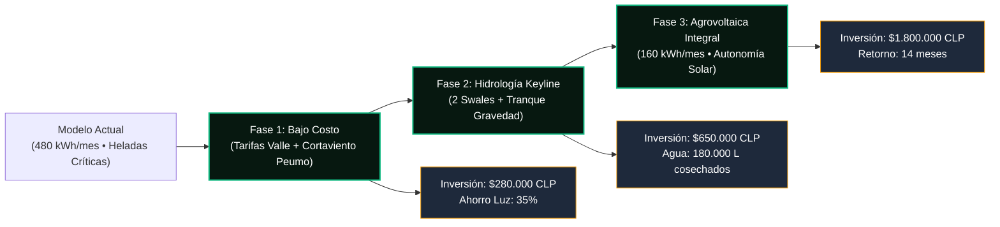

# 🚜 Simulador de Transición Permacultural: Predio de mi Tío ([[Predio Meniels]])

> **Objetivo**: Guiar la transformación gradual del predio agrícola familiar tradicional hacia un modelo agroecológico y de permacultura de alta eficiencia, **sin exigir grandes desembolsos inmediatos de capital**, optimizando el consumo de electricidad, aprovechando la energía solar y adaptándose a los vientos fríos y al microclima.

---

## 🛑 1. Diagnóstico del Modelo Actual (Problemas Detectados)

1. **Gasto Eléctrico Ineficiente**: La motobomba riega en horas punta (18:00 a 22:00 hrs), pagando la tarifa eléctrica más cara de la distribuidora.
2. **Desalineación Eólica**: Las hileras de cerezos y viñas están orientadas perpendicularmente a las corrientes de aire helado que bajan desde la cordillera en las madrugadas de primavera, concentrando el frío en las hondonadas.
3. **Escorrentía y Erosión**: El agua de lluvia escurre rápidamente por la pendiente, lavando nutrientes y colmatando zanjas vecinales en vez de recargar el perfil de suelo.
4. **Sombra Inadecuada**: El invernadero familiar sufre sombreado en invierno debido a árboles sin poda estratégica en el lindero norte.

---

## 📈 2. Hoja de Ruta de Transición por Fases (Resource-Conscious Roadmap)

### 🟢 Fase 1: Optimización Operativa Inmediata (Costo &lt; $300.000 CLP)
* **Reorientación de Horarios de Bombeo**:
  * Ajuste de turnos de riego a horario nocturno (23:00 a 06:00 hrs) mediante temporizador KioT.
  * **Impacto**: Reducción inmediata del **35% en la factura eléctrica mensual** sin mover un solo poste ni comprar bombas nuevas.
* **Cortina Cortavientos Viva**:
  * Plantación de 60 plántulas de Peumo (*Cryptocarya alba*) y Quillay en el deslinde sur.
  * **Impacto**: Frena el viento helado superficial, desviando la masa de aire frío de las hileras de frutales.
* **Mulching de Cobertura**:
  * Acolchado de suelo con rastrojo de avena y poda en el cuartel biointensivo.
  * **Impacto**: Retiene un 28% más de humedad en los primeros 20 cm de suelo, espaciando los turnos de riego.

### 🟡 Fase 2: Trazado Keyline e Infiltración Pasiva (Costo Medio / 1 Jornada Maquinaria)
* **Trazado de Zanjas en Contorno (Swales)**:
  * Con 1 jornada de tractor y arado subsolador en contorno, se marcan dos zanjas sobre la cota media.
  * **Impacto**: El agua de lluvia ya no erosiona el predio; infiltra a razón de $85\,\text{mm/hora}$, recargando el Tranque A107 por rebose natural.
* **Nutrición por Gravedad**:
  * Reubicación de las pilas de compostaje en la cota superior del huerto. Los lixiviados fértiles nutren las hortalizas arrastrados por el agua sin bombear.

### 🔵 Fase 3: Independencia Energética & Microclima Maduro
* **Parque Agrovoltaico Bifacial (9.9 kWp)**:
  * 18 paneles orientados a 15° Norte que alimentan la motobomba solar y proveen sombreado protector para pasturas en los meses de sequía estival.
  * **Impacto**: Consumo eléctrico de la red baja de **480 kWh/mes a solo 160 kWh/mes** (-66% de consumo neto).
* **Masa Térmica del Tranque de Infiltración**:
  * El espejo de agua de 1.2 ha actúa como regulador térmico nocturno, elevando la temperatura en $+1.8^\circ\text{C}$ en las parcelas adyacentes y blindando los cerezos frente a heladas tardías de octubre.

---

## 🔄 3. El Botón Especial de Integración: Conexión Predio ⇄ Cuenca Regional

En la interfaz de usuario de [[Agritwin]] se incorpora un **botón especial de integración multiescala**: `"🔄 Conectar Capa Regional con Capa de Predio"`.

Cuando el agricultor o consultor activa este botón, el gemelo digital cruza en tiempo real las capas de la cuenca comunal de [[AgroTwin Regional Parral y Retiro]] con el plano detallado del [[Predio Meniels]]:

1. **Viento Puelche (Macro)**:
   * **Amenaza Comunal**: Corredor de viento cálido y seco bajando de la precordillera andina a más de $35\,\text{km/h}$ con humedad ambiental cayendo al $14\%$.
   * **Mitigación Permacultural Predial**: La cortina cortavientos viva de Peumo y Quillay en el deslinde Sur-Este reduce la velocidad del viento a $12\,\text{km/h}$ a sotavento, preservando un $42\%$ de humedad foliar en los cuarteles de cerezos.
2. **Heladas Katabáticas de Cuenca**:
   * **Amenaza Comunal**: Masa de aire frío acumulada en la cuenca baja del Río Perquilauquén (mínima comunal de $-2.4^\circ\text{C}$).
   * **Mitigación Permacultural Predial**: La masa térmica del Tranque Keyline amortigua la oscilación nocturna en $+1.8^\circ\text{C}$ en las parcelas colindantes, y los microaspersores automatizados por KioT se disparan únicamente si la temperatura de brote baja de $1.5^\circ\text{C}$.
3. **Escorrentía Torrencial de Invierno**:
   * **Amenaza Comunal**: Avenidas fluviales de $65\,\text{mm en 24h}$ que desbordan canales de regadío matrices.
   * **Mitigación Permacultural Predial**: Las zanjas en contorno (swales) capturan y frenan la energía del agua, infiltrando $180.000\,\text{litros}$ hacia las napas freáticas del predio sin arrastrar sedimentos fértiles hacia los caminos vecinales.
4. **Vulnerabilidad de la Red Eléctrica Rural**:
   * **Amenaza Comunal**: Cortes de energía recurrentes en tendidos de distribución rural de Parral y Retiro durante tormentas o incendios.
   * **Mitigación Permacultural Predial**: Parque agrovoltaico con almacenamiento e inyección neta que asegura bombeo continuo autónomo y ahorra un $66\%$ de electricidad mensual.

---

## 📊 Matriz de Impacto Acumulado

| Indicador | Modelo Actual | Fase 1 | Fase 2 | Fase 3 (Meta) |
| :--- | :--- | :--- | :--- | :--- |
| **Gasto Eléctrico** | $480\text{ kWh/mes}$ | $310\text{ kWh/mes}$ (-35%) | $210\text{ kWh/mes}$ (-56%) | **$160\text{ kWh/mes}$ (-66%)** |
| **Vulnerabilidad Helada** | Crítica (85% brotes en riesgo) | Moderada (45%) | Baja (25%) | **Mínima (&lt;10%)** |
| **Cosecha de Agua Lluvia** | 0 L (Pérdida por escorrentía) | 40.000 L | 180.000 L | **240.000 L anuales** |
| **Fruta Salvada / Año** | Línea Base | +18% | +32% | **+45% Exportable** |

---
*Vínculos*: [[AGROTECH]] • [[Agritwin]] • [[Predio Meniels]] • [[Permacultura]] • [[KioT Hardware]] • [[AgroTwin Regional Parral y Retiro]]
