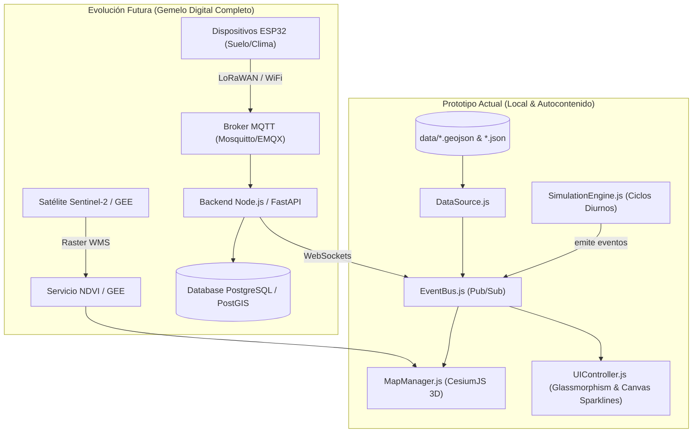

# 🌾 AgriTwin - Prototipo del Núcleo Esencial (3D Digital Twin)

**AgriTwin** es una aplicación web autocontenida de gemelo digital agrícola que visualiza imágenes satelitales en 3D (vía **CesiumJS**), parcelas agrícolas extruidas, nodos de sensores IoT interactivos y árboles frutales. Permite la inspección en tiempo real de métricas microclimáticas y del suelo (humedad, temperatura, NDVI, batería) mediante un panel lateral con estilo *glassmorphism* y gráficos de tendencia temporal en Canvas 2D.

---

## 🚀 Instrucciones para Ejecutar Localmente

Debido a las políticas de seguridad de los navegadores modernos para módulos JavaScript (`import`) y recursos 3D de CesiumJS, la aplicación debe ejecutarse a través de un servidor HTTP local.

### Opción A: Usando Python (Preinstalado en la mayoría de sistemas)
Abre una terminal en la carpeta del proyecto y ejecuta:

```bash
# Python 3
python3 -m http.server 8080
```
Luego abre tu navegador en: **`http://localhost:8080`**

---

### Opción B: Usando Node.js (`npx serve` o `live-server`)
Si tienes Node.js instalado:

```bash
npx serve .
```
O con `live-server`:
```bash
npx live-server
```

---

### Opción C: VS Code Live Server
Si usas Visual Studio Code, instala la extensión **Live Server**, abre `index.html` y haz clic en *"Go Live"*.

> **Nota sobre CesiumJS sin API Key:** La aplicación utiliza de forma nativa la capa abierta de alta resolución **Esri World Imagery** (`services.arcgisonline.com`), por lo que **no requiere** un token de pago ni registro en Cesium Ion para funcionar localmente fuera de la caja.

---

## 🛠️ Estructura del Código y Módulos

El proyecto sigue una arquitectura **desacoplada y orientada a eventos**, lista para escalar hacia producción:

```
Agritwin/
├── index.html                   # Interfaz de usuario con barra superior, controles y panel lateral
├── css/
│   ├── main.css                 # Variables de tema Obsidian Dark, tipografía Inter/Outfit
│   ├── glassmorphism.css        # Tarjetas semitransparentes, desenfoque de fondo (backdrop-filter)
│   └── components.css           # Badges de estado, keyframes de pulso, sparklines, toggles
├── js/
│   ├── app.js                   # Módulo principal y orquestador de arranque
│   ├── utils/
│   │   └── EventBus.js          # Bus de eventos Pub/Sub para desacoplar Mapa, UI y Datos
│   ├── map/
│   │   └── MapManager.js        # Visor CesiumJS 3D, mapas satelitales, vuelos de cámara y selección
│   ├── data/
│   │   └── DataSource.js        # Proveedor abstracto de datos (carga GeoJSON/JSON e índices)
│   ├── entities/
│   │   ├── ParcelManager.js     # Parcelas 3D extruidas y coloreado por estado NDVI
│   │   ├── SensorManager.js     # Pines 3D IoT con anillos de pulso animado y cambio de color
│   │   └── CropManager.js       # Árboles 3D/geometría de dosel en el predio
│   ├── ui/
│   │   ├── UIController.js      # Control de paneles laterales, toggles de capas y alertas
│   │   └── ChartManager.js     # Renderizador de gráficos de tendencia en Canvas 2D
│   └── sim/
│       └── SimulationEngine.js  # Motor de simulación IoT (ciclos diurnos y estrés hídrico)
├── data/
│   ├── farm_parcels.geojson     # Delimitación GeoJSON de parcelas agrícolas (Manzanos, Cerezos, Viñedos)
│   └── farm_entities.json       # Base de datos JSON de sensores IoT y árboles frutales
└── README.md                    # Documentación y Hoja de Ruta de Arquitectura Futura
```

---

## 🔮 Hoja de Ruta y Guía de Extensión Futura

Este prototipo fue diseñado con puntos de extensión explícitos para evolucionar hacia un gemelo digital completo de escala industrial:

### 1. Conexión a Sensores IoT Reales (MQTT / ESP32 / LoRaWAN)
* **Estado Actual:** `SimulationEngine.js` actualiza periódicamente la memoria local mediante un temporizador y emite eventos en `EventBus`.
* **Cómo Extender:** 
  1. Instalar `mqtt` via CDN o paquete npm (`mqtt.min.js`).
  2. En `DataSource.js`, suscribirse al broker MQTT sobre WebSockets (ej. `wss://broker.hivemq.com:8884/mqtt` o un servidor Mosquitto propio en el campo):
     ```javascript
     const client = mqtt.connect('wss://tu-broker-mqtt:8884/mqtt');
     client.subscribe('agritwin/predio1/sensores/+/telemetry');

     client.on('message', (topic, payload) => {
       const telemetry = JSON.parse(payload);
       dataSource.updateSensorTelemetry(telemetry.sensorId, telemetry);
     });
     ```
  3. `EventBus` notificará automáticamente a Cesium y a la UI sin requerir cambios en la capa visual.

### 2. Backend Geoespacial y Persistencia (PostgreSQL / PostGIS + TimeScaleDB)
* **Estado Actual:** Archivos `farm_parcels.geojson` y `farm_entities.json` estáticos.
* **Cómo Extender:**
  1. Crear tablas espaciales en PostGIS: `parcels (id, name, geom Geometry(Polygon, 4326), crop_type)` y `telemetry_history (sensor_id, timestamp, moisture, temp, battery)`.
  2. Reemplazar los métodos `fetch()` en `DataSource.js` por llamadas API REST / GraphQL:
     ```javascript
     async loadAll() {
       const parcels = await fetch('/api/v1/spatial/parcels').then(r => r.json());
       const sensors = await fetch('/api/v1/telemetry/live').then(r => r.json());
       // ...
     }
     ```

### 3. Integración con Google Earth Engine (GEE) y Copernicus Sentinel-2
* **Estado Actual:** Coloreado estático de parcelas según la propiedad `ndvi` en GeoJSON.
* **Cómo Extender:**
  1. Conectar una API en Python/Node.js que consulte la API de Google Earth Engine o Sentinel Hub WMS.
  2. En `MapManager.js`, agregar la capa WMS dinámica calculada semanalmente:
     ```javascript
     const ndviLayer = new Cesium.WebMapServiceImageryProvider({
       url: 'https://shservices.sentinel-hub.com/ogc/wms/YOUR-INSTANCE-ID',
       layers: 'NDVI-VIZ',
       parameters: { transparent: 'true', format: 'image/png' }
     });
     viewer.imageryLayers.addImageryProvider(ndviLayer);
     ```

### 4. Simulación de Flujos de Agua y Energía
* **Estado Actual:** Lectura individual de humedad.
* **Cómo Extender:**
  * **Agua:** Implementar un módulo `HydrologyEngine.js` que calcule la evapotranspiración de cultivo ($ET_c = ET_0 \times K_c$) comparando precipitaciones y balance de riego por m³.
  * **Energía:** Crear `MicrogridEngine.js` para simular la generación de paneles solares que alimentan las bombas de riego y el estado de carga de las baterías.

### 5. Estrategia de Tracción Comercial con Clientes (Go-To-Market)
Para derribar la inercia del productor agrícola y acelerar la adopción en terreno:
* **Piloto "Cuartel Centinela" (Zero-Risk):** Instalación de 1 nodo KioT en el cuartel más vulnerable (zona de heladas o estrés hídrico) por 30 días sin costo anticipado. Al validar alertas preventivas o 25% de ahorro en bombeo, el productor adquiere la cobertura predial completa (>75% conversión).
* **Caballo de Troya Satelital:** Entrega de diagnósticos gratuitos de vigor (NDVI) y balance hídrico con Sentinel-2 para captar interés inbound y justificar la sensórica en tierra.
* **Alianzas de Cuenca:** Acuerdos con Juntas de Vigilancia de Canales del Río Maule y gremios (Fedefruta, Vinos de Chile) para cerrar grupos de 20-50 predios por asamblea técnica.
* **Canal Exportadoras B2B:** Demanda impulsada por normativas de la Unión Europea (EUDR y huella de carbono), donde la exportadora cofinancia o exige el Pasaporte Verde a sus productores asociados.

---

## 📊 Diagrama de Arquitectura de Datos (Actual vs. Futuro)


